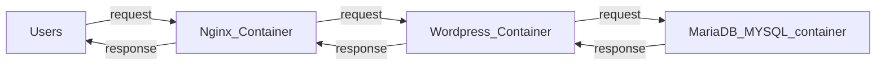

# Section 1: Understanding Microservices

## Q0: What is a Microservice?

Microservices are an `architectural and organizational approach` `to` `building software as` a `suite of small, independent services that communicate over well-defined APIs or events` and `are` `loosely coupled`, `independently deployable`, and `owned by small teams`.

Microservices solve key monolithic problems like tight coupling, scaling bottlenecks, and deployment complexity by splitting functionality into loosely coupled, independently deployable services.

## Q1: What is Coupling?

`Coupling` refers to `the degree of interdependence` `between` `software modules or services`.

**`Tight coupling`**

> means `services/modules depend heavily on each other's internal logic` `or data structure`. A change in one often breaks the other.

**`Loose coupling`**

> means services `communicate through` `well-defined interfaces` (`like APIs or events`), reducing the ripple effect of changes.

| Type of Coupling  | Description                                                                                              |
| ----------------- | -------------------------------------------------------------------------------------------------------- |
| Content Coupling  | One class can access the private members of another class. e.g., Reflection in .NET and Java.            |
| Common Coupling   | Two classes access the same shared data i.e. global variables, static properties or a table in database. |
| Control Coupling  | When a function controls the flow of another function.                                                   |
| Data Coupling     | When two systems share the same database                                                                 |
| Type Use Coupling | When a member or property of class B is of type class A                                                  |
| Stamp Coupling    | When in Class B a method has a parameter of type Class A, but only uses part of it.                      |
| Import Coupling   | When a library is imported into another program i.e. DLL files in Windows                                |

## Q2: How is coupling related to Microservices?

**Clear Interfaces:**

> Microservices communicate through clear interfaces e.g., REST APIs, events or messaging.

**Independent Deployment:**

> Microservices are developed, deployed and scaled independently.

**Own Data:**

> Each microservice has its own dedicated database, avoiding shared schemas or direct database access between services.

## Q3: What is Cohesion?

## Q4: What is better? High Cohesion or Low Cohesion?

`Cohesion` is a `measure of the degree` `to which the elements of a module, software or code` `are related`.
Is a degree to which all elements of a module, software or code are directed towards performing a single task.

`High Cohesion is GOOD!`
Example of low Cohesion: Helper Classes

```java
// helper class is not performing tasks related to one module / one intent so it's low Cohesion
// 3 methods doing 3 diffrent things.
public static class Helper
{
    public static string DateToString(DateTime dateTime) { ... }
    public static SmtpConfig GetSmtpConfig();
    public static void LogError(string error);
}
```

## Q5: What are the differences between Monolithic, SOA and Microservices

| Category                      | Monolith                                                                      | SOA                                                                          | Microservice                                                      |
| ----------------------------- | ----------------------------------------------------------------------------- | ---------------------------------------------------------------------------- | ----------------------------------------------------------------- |
| **Codebase Structure**        | Application is made of a `single code base`                                   | Tries to `break down the monolith app to smaller components`                 | Microservices are `more fine-grained and smaller compared to SOA` |
| **Execution & Communication** | Application runs as a `single process and entire code shares the same memory` | Services` communicate via Synchronous API calls` (SOAP or REST)              | Microservices `communicate via Rest APIs, Events and Messages`    |
| **Database Management**       | All functions in the code `share the same database`                           | In SOA often services `share the same database` although not a best practice | `Each service` `has its dedicated database`                       |

- ### What are Benefits and Drawbacks of Monolith Application?

| Category      | Aspect                 | Description                                                                                                                                                                          |
| ------------- | ---------------------- | ------------------------------------------------------------------------------------------------------------------------------------------------------------------------------------ |
| **Benefits**  | Simplicity             | Monolithic Applications are easier to build, test and deploy.                                                                                                                        |
|               | Cross-cutting concerns | One piece of code can handle monitoring, logging, security etc.                                                                                                                      |
|               | Performance            | Different classes or functions communicate directly and share the same memory so the application runs faster compared to Microservices where services communicate through a network. |
| **Drawbacks** | Reliability            | A fatal error in any part of the application will crash the entire system.                                                                                                           |
|               | Updates and Deployment | Even for a small change the entire application has to be re-deployed.                                                                                                                |
|               | Technology Stack       | The entire application has to be developed with one single technology stack.                                                                                                         |

- ### What are Benefits and Drawbacks of microservices architecture?

| Category      | Aspect                     | Description                                                                                         |
| ------------- | -------------------------- | --------------------------------------------------------------------------------------------------- |
| **Benefits**  | Independent deployment     | Microservices can be deployed independently, enabling faster and more agile development cycles.     |
|               | Independent scaling        | Services can be scaled out independently based on demand, improving resource utilization.           |
|               | Fault tolerance            | Failure in one service does not directly impact other services, improving system resilience.        |
|               | Maintainability            | Smaller codebases make it easier and quicker for new team members to learn and contribute.          |
|               | Polyglot technology        | Different microservices can be built using different technology stacks best suited to each need.    |
|               | Asynchronous communication | Microservices can communicate asynchronously, reducing tight coupling between services.             |
| **Drawbacks** | System complexity          | Microservices add design and build complexity compared to monolithic architectures.                 |
|               | Organizational overhead    | Requires changes in teams, leading to more teams, increased staff, and greater collaboration.       |
|               | Increased cost             | Building and operating microservices can be more expensive due to added infrastructure and effort.  |
|               | Troubleshooting challenges | Diagnosing and tracking problems across distributed services becomes more difficult.                |
|               | Testing difficulties       | Testing microservices-based systems is more challenging due to distributed nature and dependencies. |
|               | Not always suitable        | Microservices architecture is not always fit for every project or use case.                         |

# Section 2: Designing Microservices Systems

# Section 3: Microservice Communication and Reliability Patterns

# Section 6: Containerization and Deployment

### Q: Explain Container in Microservices

- A `container` `is a bundling of an application` (i.e. micro service) `and all its dependencies as a package`, that allows it to be deployed easily and consistently regardless of environment.
- For example a software that only runs on Linux and uses MySQL can be deployed to a Windows server without having to install MySQL.
- `Containers use Virtualisation features of the host operating system`.
- `Containers allow us to deploy Microservices to various environments`. Also services can be built with different technologies but run side by side.
- Dockerized App (microservice)



---

# Section 7: Supporting Infrastructure and Service Mesh

# Section 8: Advanced Data Patterns

## Q: How do we deploy the Microservices?

Microservices need modern deployment strategies for zero downtime and safe rollouts.

- ### Common strategies:
  - **Blue-Green Deployment**
  - **Canary Release**
  - **Rolling Updates**

---

- ### Blue-Green Deployment
  - `Two identical environments`: **`Blue`** (live) and **`Green`** (new version)
  - `Route traffic` to **Green** only `when it's fully tested`.
  - `Instant rollback`: just switch traffic back to **Blue**.

---

- ### Canary Release
  - `Release` the `new version to a small % of users`.
  - `Gradually increase exposure`.
  - Rollback if any errors or performance issues appear.

---

- ### Rolling Updates
  - `Replace` `old instances of the service` `with new ones`, `one by one`.
  - Some instances of the app always stay running.
  - No downtime, but, `Users` `might hit mixed versions briefly`.
